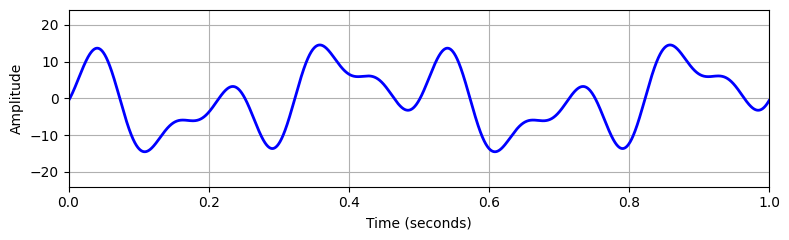

# IoT Individual assingment
#### Lorenzo Frangella ID 1899674
---
This GitHub repository contains the code for the individual assignment of IoT Algorithms and Services.
The project is composed by the following parts:

1. Signal Generation code
2. Code for the ESP32 to sample the signal, adjust the frequency and send messages.
3. Arduino code for a ESP8266 to measure the power used by the ESP32 while sampling.
4. Some evaluations over the power consumtions based on the sampling frequency

---

## How to execute the project

### Signal Generation

The first step needed is to generate a signal, in this project signal is generated by a python [script](https://github.com/LorenzoFrangella/Individual-assignment-1899674-iot/blob/main/signal_generation.ipynb) as audio output.
With that script is possible to generate a signal as a sum of multiple sinusoid functions given by the formula:
$$\sum_{k=1}^n a_k sin(2\pi t f_k+ \phi_k)$$
Below an example of a signal generated with the sum of the following sinusoids:

    a = [7,8,5]     f = [2,6,10]    phase = [0.6,0,0.2]

  

Once the signal is generated it is played from the pc, and thanks to a [circuit](https://forum.arduino.cc/t/how-to-read-data-from-audio-jack/458301/3) the signal can be passed to a GPIO pin
of the ESP32 where is possible to sample (an ADC pin). 

---

### Signal Sampling
The code for the ESP32 can be found in the folder "esp-code" wich is structured as the following.

    esp-code
        |
        |->main
            | -> main.c         ---->   File containing the code executed on startup 
            | -> fft_config.h   ---->   File to setup the fft
            | -> mqtt.h         ---->   File to use mqtt
            | -> sampling.h     ---->   File for sampling task
            | -> sender.h       ---->   File for sampling task
            | -> structs.h      ---->   Data structures to pass arguments to tasks
            | -> wifi.h         ---->   File to use wifi

Code can be built and flashed in the esp by entering in the folder **esp-code** and run

    idf.py build flash monitor

To setup the parameters needed to make the project run is necessary to enter into menuconfig, 
in the menu **Sampling configuration** and set:
    
    (1000) Set the default sampling frequency in Hz
    (1) Decide to run or not the fft to adjust in an adaptive manner the sampling frequency
    (0) Decide if enable the round trip time measurement
    (5) Threshold value for the Z score, to identify outliers
    (mqtt server address) Set the server address for mqtt
    (topic ) Set the topic to where publish messages
    (username) mqtt username to connect
    (password_mqtt) Set the password to connect to mqtt server
    (ssid) WIFI SSID
    (password_wifi) WIFI PASSWORD

Also another parameter in menuconfig must be changed:

    Component config -> FreeRTOS -> Kernel -> ConfigTICK_RATE_HZ

By default the value of this parameter is setted to 100. This means that the clock tick resolution of
FreeRTOS is 100Hz. The problem is that in this project to adjust the frequency of sampling to values 
higher than 100Hz is not possible using vTaskDelay() function, since this function takes as input the 
number of ticks to wait to restart. Increasing this parameter to its maximum (1000) allows to sample
up to 1kHz.

Sampling at higher rates is still possible but not trivial, the easiest way to sample at higher frequency
is to sample at maximum ADC frequency which is 2MHz. Then we will see drawbacks of sampling at this rates.

---

### FFT execution

If set to 1 the parameter FFT_ENABLED in menuconfig the adaptive frequency adjusting is performed using 
fft of the library [esp-dps](https://github.com/espressif/esp-dsp/tree/master). Sampling frequency is set 
to 2 times the max frequency detected. Frequency outliers are detected by means of z-score index computed as
follows:
$$ Z = \frac{x - \mu}{\sigma}$$
Only values above a certain threshold will be detected as frequencies that are present in the signal.
This value of threshold can be set in menuconfig.

> FFT is high memory consuming and I've exprerienced that works with buffers up to 2048 elements.
> To be sure that everything works well sampling frequency is set to 1KHz and buffer size to 2048.
> Some errors, like nan values, were experienced using buffer sizes larger than 2048, Those values allow us to 
> find signals from 0.5 up to 500Hz. The limit of 1KHz is imposed also from vTaskDelay function.

---

### WIFI and MQTT signal transmission 

While sampling the signal, in order to reduce the number of transmissions that are high energy consuming, the values are stored
in a buffer which size is 5 times the sampling frequency, in order to send data every 5 seconds. After the sampling of 5 second 
the average is sent using mqtt and wifi.
To send messages WIFI is necessary, ssid and password can be set in menuconfig, and also mqtt server and topic is needed and 
can be changed into menuconfig.
Also Mqtt requires an username and a password, the comunication is over mqtts, so it is encrypted by tls, username and password for 
authentication are inserted into the menuconfig.

---

## Tests

In the following part we will exectute some tests in order to evaluate the performances of the project. We are interested 
in evaluating the performances in recognizing the maximum frequency to adjust the sampling frequency. The second objective in
performance evaluation is the energy consumption, how much the samplig frequency affects the energy consumption and the energy drain
in transmission of packet with wifi. Other field of interest for the evaluation is the round trip time for mqtt messages.

### Max frequency identification

For to evaluate the performances in evaluate the max frequency we choose 3 signals, all of them made from the sum of 3 sinusoids made
from random frequencies. In the file fft_experiments.txt there are the three experiments performed to test if the maximum frequency is
detected, and also the z-score of each value is printed in order to define which is the best threshold to use.
We can find out that values of z-scores of signals are: 4.335818, 4.230448, 4.618001, 4.535644, 5.050312, 4.404761, 3.690407, 4.462935,
4.953433. These are only 9 values and the only thing that we can observe without a statistical analysis is that they are all of them above 3.69. This is not a rule to choose the z-index, performing several experiments it is possible to adjust the threshold to achieve an higher level of accuracy. 
> An higher level of threshold could filter some frequencies near the peak, an andjust correctly the sampling frequency.
> Drawbacks: An high number of experiments is needed to define a right threshold, an option could be an implementation of peaaks
in the values that are above the threshold.

### Energy consumption comparison
In the file ina_219_d1_mini.ino there is the Arduino code to run in order to measure the energy consumption of the board.

### Round trip time measurement
For rtt measurement there is a Variable in menuconfig, setting this variable to 1 a script that sends periodically the current time.
Time is synchronized using ntp protocol on the esp32.
On my local machine there is a script python in the file power_consumption_eval.ipynb, that allow us to measure the mean round trip time.
